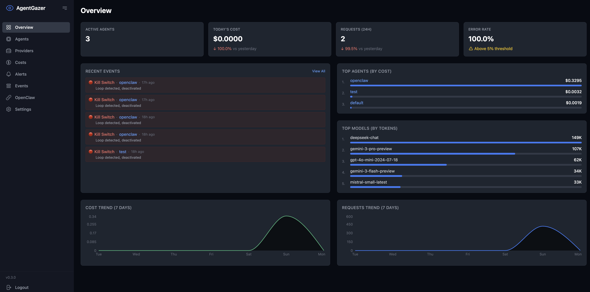

# AgentGazer

**From Observability to Control** — The missing governance layer for AI agents.

Most observability tools just **watch**. AgentGazer **controls**.



| Feature | Langsmith | Langfuse | Helicone | AgentGazer |
|---------|:---------:|:--------:|:--------:|:----------:|
| Tracing | ✅ | ✅ | ✅ | ✅ |
| Cost Tracking | ✅ | ✅ | ✅ | ✅ |
| **Rate Limiting** | ❌ | ❌ | ❌ | ✅ |
| **Model Override** | ❌ | ❌ | ❌ | ✅ |
| **Kill Switch** | ❌ | ❌ | ❌ | ✅ |
| **Security Shield** | ❌ | ❌ | ❌ | ✅ |
| **MCP Integration** | ❌ | ❌ | ❌ | ✅ |
| Self-hosted | ❌ | ✅ | ❌ | ✅ |
| Zero SaaS cost | ❌ | ❌ | ❌ | ✅ |

**[Documentation](https://agentgazer.com)** | **[中文文件](https://agentgazer.com/zh/)**

## Install

```bash
# One-line install (recommended) — works without Node.js
curl -fsSL https://raw.githubusercontent.com/agentgazer/agentgazer/main/scripts/install.sh | sh

# Homebrew (macOS / Linux)
brew install agentgazer/tap/agentgazer
```

This starts a local Express+SQLite server, an LLM proxy, and a web dashboard — no cloud dependencies.

## How it works

Point your LLM client's base URL at `http://localhost:18900/agents/{your-agent}/agentgazer`. The proxy forwards requests to the real provider, extracts usage metrics from responses (including SSE streams), and records them locally.

All data is stored in a local SQLite database (`~/.agentgazer/data.db`) and exposed through a REST API and web dashboard.

## Governance Features

### 🛡️ Kill Switch — Stop runaway agents

Detects infinite loops using SimHash similarity scoring. When an agent keeps making similar requests (same prompts, same tool calls, similar responses), AgentGazer auto-deactivates it before it burns your budget.

```
Score = similar_prompts × 1.0 + similar_responses × 2.0 + repeated_tool_calls × 1.5
Score > Threshold → Agent deactivated
```

Configure per-agent in the Dashboard: window size, score threshold, enable/disable.

### 🔄 Model Override — Force cheaper models

Replace expensive models with cheaper alternatives without changing your agent code. The proxy rewrites the request before forwarding.

```
Agent requests: gpt-4           Your override rule: openai → gpt-4o-mini
      ↓                                    ↓
   Proxy intercepts ──────────────────→ Rewrites to gpt-4o-mini
      ↓
   Sent to OpenAI (90% cost savings)
```

Set per-agent per-provider rules in the Dashboard.

### ⏱️ Rate Limiting — Prevent quota exhaustion

Sliding window rate limits per provider. Agents exceeding the limit receive `429 Too Many Requests` with `Retry-After` header.

```
Provider: openai
Limit: 100 requests / 60 seconds
```

Configure in the Dashboard or via API.

### 🔒 Security Shield — Protect against prompt injection & data leaks

Multi-layer defense for AI agents:

- **Prompt Injection Detection** — Detects jailbreak attempts, role hijacking, system prompt overrides (English + Chinese patterns)
- **Sensitive Data Masking** — Automatically redacts API keys, credit cards, crypto addresses, and personal data from requests
- **Tool Call Restrictions** — Allowlist/blocklist specific tools, block dangerous categories (filesystem, network, code execution), rate limit tool usage

Actions: `log` (record only), `alert` (notify + log), `block` (reject request).

Configure globally or per-agent in the Dashboard.

### 🤖 MCP Integration — Cost-aware AI agents

AgentGazer includes an [MCP](https://modelcontextprotocol.io/) (Model Context Protocol) server that lets AI agents query their own cost and usage data. Agents can check their budget, estimate costs before expensive operations, and report spending — all without leaving the conversation.

**Tools:** `get_token_usage`, `get_cost`, `get_budget_status`, `estimate_cost`, `whoami`

```bash
# Install (already included with AgentGazer CLI)
agentgazer-mcp init

# Or install standalone for remote agents
npm install -g @agentgazer/mcp
```

Add to Claude Code settings (`~/.claude/settings.json`):

```json
{
  "mcpServers": {
    "agentgazer": {
      "command": "agentgazer-mcp",
      "env": {
        "AGENTGAZER_ENDPOINT": "http://localhost:18880",
        "AGENTGAZER_TOKEN": "your-token-here",
        "AGENTGAZER_AGENT_ID": "my-agent"
      }
    }
  }
}
```

See the [MCP documentation](https://agentgazer.com/en/guide/mcp) for detailed setup and usage.

## Quick start

### Using the proxy (recommended)

```bash
# Start AgentGazer
agentgazer start

# Point your OpenAI client at the proxy
export OPENAI_BASE_URL=http://localhost:18900/agents/my-agent/agentgazer

# Use your LLM client as normal — calls are recorded automatically
```

The proxy auto-detects the provider from the request URL and forwards to the correct upstream API. Supported providers:

| Provider | Host pattern | | Provider | Host pattern |
|----------|-------------|---|----------|-------------|
| OpenAI | `api.openai.com` | | DeepSeek | `api.deepseek.com` |
| Anthropic | `api.anthropic.com` | | Moonshot | `api.moonshot.cn` |
| Google | `generativelanguage.googleapis.com` | | Zhipu (智譜) | `open.bigmodel.cn` |
| Mistral | `api.mistral.ai` | | MiniMax | `api.minimax.chat` |
| | | | Baichuan (百川) | `api.baichuan-ai.com` |

**Simplified Routing (Recommended):**

```bash
# Format: /agents/{agent-name}/{provider}
curl http://localhost:18900/agents/my-agent/openai \
  -H "Content-Type: application/json" \
  -d '{"model": "gpt-4o", "messages": [{"role": "user", "content": "hello"}]}'
```

The proxy automatically injects the stored API key and handles provider-specific endpoints.

## CLI commands

```bash
agentgazer onboard          # Initial setup wizard
agentgazer start            # Start server, proxy, and dashboard
agentgazer start -v         # Start with verbose logging (debug mode)
agentgazer stop             # Stop all services
agentgazer status           # Check if services are running
agentgazer logs             # View service logs
agentgazer overview         # Real-time TUI dashboard
agentgazer doctor           # Diagnose common issues
agentgazer providers        # List configured providers
agentgazer provider add <name> [key]  # Add provider API key
agentgazer agents           # List all agents
agentgazer events           # List recent events
agentgazer uninstall        # Remove AgentGazer
```

### Start options

```
agentgazer start [options]

Options:
  --port <number>            Server/dashboard port (default: 18880)
  --proxy-port <number>      LLM proxy port (default: 18900)
  --retention-days <number>  Data retention period in days (default: 30)
  --no-open                  Don't auto-open browser
  -v, --verbose              Enable debug logging
```

## API

All API endpoints require authentication via `Authorization: Bearer <token>` or `x-api-key: <token>` header.

### Event ingestion

```
POST /api/events
```

Accepts a batch of events:

```json
{
  "events": [
    {
      "agent_id": "my-agent",
      "event_type": "llm_call",
      "provider": "openai",
      "model": "gpt-4o",
      "tokens_in": 150,
      "tokens_out": 50,
      "latency_ms": 1200,
      "status_code": 200,
      "source": "sdk",
      "timestamp": "2025-01-15T10:30:00.000Z"
    }
  ]
}
```

Rate limit: 1000 events/minute per API key.

### Querying events

```
GET /api/events?agent_id=my-agent&from=2025-01-01&to=2025-01-31&provider=openai&model=gpt-4o&search=error
```

### Exporting data

```
GET /api/events/export?format=csv&agent_id=my-agent
GET /api/events/export?format=json&agent_id=my-agent
```

### Agent management

```
GET    /api/agents
POST   /api/agents/register   { "agent_id": "my-agent", "name": "My Agent" }
POST   /api/agents/heartbeat  { "agent_id": "my-agent" }
```

### Statistics

```
GET /api/stats/summary?agent_id=my-agent
GET /api/stats/timeseries?agent_id=my-agent&bucket=hour
```

### Alerts

```
GET    /api/alerts
POST   /api/alerts
PUT    /api/alerts/:id
DELETE /api/alerts/:id
PATCH  /api/alerts/:id/toggle
GET    /api/alert-history
```

Alert rule types:

- **agent_down** — fires when an agent hasn't sent a heartbeat within `duration_minutes`
- **error_rate** — fires when error rate exceeds `threshold`% over `window_minutes`
- **budget** — fires when daily spend exceeds `threshold` USD

Delivery channels: webhook (with exponential backoff retry), email (SMTP), and Telegram.

See `packages/server/openapi.yaml` for the full OpenAPI specification.

## Alerting

### Webhook alerts

Webhooks are delivered via POST with JSON body and retried up to 3 times with exponential backoff (1s, 4s, 16s).

```json
{
  "agent_id": "my-agent",
  "rule_type": "error_rate",
  "message": "Agent \"my-agent\" error rate is 25.0% (5/20) over the last 15m (threshold: 10%)",
  "timestamp": "2025-01-15T10:30:00.000Z"
}
```

### Email alerts

Set SMTP environment variables to enable email delivery:

```bash
export SMTP_HOST=smtp.example.com
export SMTP_PORT=587
export SMTP_USER=alerts@example.com
export SMTP_PASS=secret
export SMTP_FROM=alerts@agentgazer.com
export SMTP_SECURE=false
```

## Docker

```bash
docker compose up -d
```

This builds and runs AgentGazer with persistent storage. The dashboard is available at `http://localhost:18880` and the proxy at `http://localhost:18900`.

## Architecture

```
┌───────────────────────────────────────────────────┐
│                  agentgazer start                  │
│                                                    │
│  ┌─────────────┐  ┌─────────────┐  ┌───────────┐  │
│  │  Dashboard   │  │   Express   │  │   LLM     │  │
│  │  (React)     │  │   Server    │  │   Proxy   │  │
│  │  :18880      │  │  :18880/api │  │  :18900   │  │
│  └──────┬───────┘  └──────┬──────┘  └─────┬─────┘  │
│         │                 │               │        │
│         │          ┌──────┴──────┐        │        │
│         └─────────►│   SQLite    │◄───────┘        │
│                    │  data.db    │                 │
│                    └─────────────┘                 │
└───────────────────────────────────────────────────┘
```

## Packages

| Package | Description |
|---------|-------------|
| `agentgazer` | CLI entry point — starts server, proxy, and dashboard |
| `@agentgazer/server` | Express API server with SQLite storage |
| `@agentgazer/proxy` | Transparent LLM proxy with metric extraction |
| `@agentgazer/mcp` | MCP server for cost-aware AI agents |
| `@agentgazer/shared` | Shared types, schemas, provider detection, and pricing |

## Cost tracking

AgentGazer automatically calculates USD cost for known models when token counts are available. Supported models include GPT-4o, GPT-4, Claude Opus/Sonnet/Haiku, Gemini, Mistral, Command-R, and others. See `packages/shared/src/pricing.ts` for the full pricing table.

> **Note:** Cost estimates are approximate and may differ from actual billing, especially for cached tokens. Always verify with your provider's official console for accurate billing information.

## Configuration

On first run, AgentGazer creates `~/.agentgazer/config.json` with a randomly generated auth token. The SQLite database is stored at `~/.agentgazer/data.db`.

To reset the auth token:

```bash
agentgazer --reset-token
```

## API Key Security

Provider API keys are **never stored as plaintext**. AgentGazer uses OS-level secure storage:

| Platform | Storage Backend |
|----------|----------------|
| **macOS** | Keychain (via `security` CLI) |
| **Linux (desktop)** | libsecret / GNOME Keyring |
| **Linux (headless)** | AES-256-GCM encrypted file |

Keys are encrypted at rest and only decrypted in memory when needed for API calls. The encryption key for headless systems is derived from machine-specific identifiers.

If you previously stored keys in plaintext config, AgentGazer automatically migrates them to secure storage on startup.

## Uninstall

```bash
# If installed via curl | sh
agentgazer uninstall
# Or: curl -fsSL https://raw.githubusercontent.com/agentgazer/agentgazer/main/scripts/uninstall.sh | sh

# If installed via Homebrew
brew uninstall agentgazer

# If installed via npm
npm uninstall -g agentgazer
```

User data (`~/.agentgazer/`) is preserved by default. The curl uninstaller will prompt you; for other methods, manually remove `~/.agentgazer/` if desired.

## Environment variables

| Variable | Description |
|----------|-------------|
| `NODE_ENV` | Set to `production` for JSON log output |
| `LOG_LEVEL` | Log verbosity: `debug`, `info`, `warn`, `error` (default: `info`) |
| `SMTP_HOST` | SMTP server hostname for email alerts |
| `SMTP_PORT` | SMTP port (default: 587) |
| `SMTP_USER` | SMTP username |
| `SMTP_PASS` | SMTP password |
| `SMTP_FROM` | Sender email address (default: `alerts@agentgazer.com`) |
| `SMTP_SECURE` | Use TLS (`true`/`false`, default: `false`) |
| `TELEGRAM_BOT_TOKEN` | Telegram bot API token for Telegram alerts |
| `TELEGRAM_CHAT_ID` | Telegram chat/group ID for notifications |

## Development

```bash
# Install dependencies
npm install

# Build all packages
npm run build

# Run tests
npm test

# Dev mode (watch)
npm run dev
```

## License

AGPL-3.0
